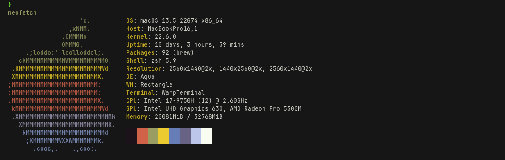
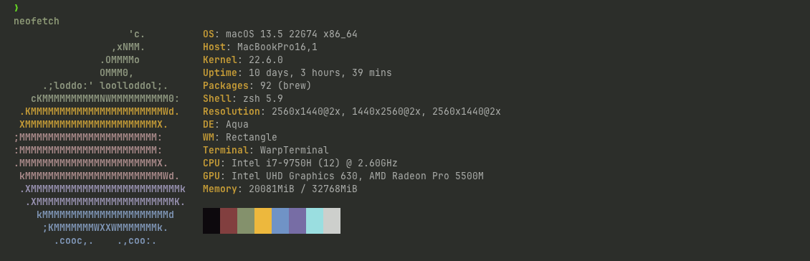

# Warp Themes

This is a set of themes for Warp Terminal.

If you want to get Warp, download it from [here](https://app.warp.dev/referral/2K4GVJ)

## Installation

**NOTE** The install scripts only works on Mac for the time being. I am working on making them more flexible as we now have a Linux version of Warp.

### Installation on Apple Computers

To install the themes is simple:

* Choose the theme you want and run the command below the image it to install
* Restart Warp
* Launch the theme picker: <kbd>ctrl</kbd> + <kbd>⌘</kbd> + <kbd>T</kbd>
    * you can also open the Command Palette (<kbd>⌘</kbd> + <kbd>P</kbd>) and search for `Open Theme Picker`
* Select the newly installed theme
* Click the `✓` button at the bottom
* Enjoy your new theme

### Installation on Linux Computers

* Chose the theme you wan to install
* Brows to the `yaml_files` folder
* Copy the contents of the theme you want then past it in one of the following directories:
  * `~/.config/warp-terminal/themes`
  * `~/.local/share/warp-terminal/themes`
  * `~/.local/state/warp-terminal/themes`

## Available Themes

### 117

```
curl -s -N 'https://raw.githubusercontent.com/SilentGlasses/warp_themes/main/117.sh' | bash
```



### Kali Blue

```
curl -s -N 'https://raw.githubusercontent.com/SilentGlasses/warp_themes/main/kali_blue.sh' | bash
```


### Material Dark

```
curl -s -N 'https://raw.githubusercontent.com/SilentGlasses/warp_themes/main/material_dark.sh' | bash
```


### Matrix Dark

```
curl -s -N 'https://raw.githubusercontent.com/SilentGlasses/warp_themes/main/matrix_dark.sh' | bash
```


### mjolnir

```
curl -s -N 'https://raw.githubusercontent.com/SilentGlasses/warp_themes/main/mjolnir.sh' | bash
```



### Nord Dark

```
curl -s -N 'https://raw.githubusercontent.com/SilentGlasses/warp_themes/main/nord_dark.sh' | bash
```


### Nord Light

```
curl -s -N 'https://raw.githubusercontent.com/SilentGlasses/warp_themes/main/nord_light.sh' | bash
```


### Proton Dark

```
curl -s -N 'https://raw.githubusercontent.com/SilentGlasses/warp_themes/main/proton_dark.sh' | bash
```


### Retro Green

```
curl -s -N 'https://raw.githubusercontent.com/SilentGlasses/warp_themes/main/retro_green.sh' | bash
```


