```
                        ⣰⠛⠛⠛⠛⠛⠛⠛⠛⠛⠛⠛⠛⠛⠛⠛⣦
                       ⡞⠐⠐⠐⠐⠐⠐⠐⠐⠐⠐⠐⠐⠐⠐⠐⠐⠿
⣴⣿⣿⣿⣿⣿⣿⣿⣿⣿⣿⣿⣿⣿⣿⣿⣿⣿⣿⡞⠐⠐⠐⠐⠐⠐⠐⠐⠐⠐⠐⠐⠐⠐⠐⠐⠐⠿
⣿⣿⣿⣿⣿⣿⣿⣿⣿⣿⣿⣿⣿⣿⣿⣿⣿⣿⡞⠐⠐⠐⠐⠐⠐⠐⠐⠐⠐⠐⠐⠐⠐⠐⠐⠐⠐⠿
⣿⣿⣿⣿⣿⣿⣿⣿⣿⣿⣿⣿⣿⣿⣿⣿⣿⡞⠐⠐⠐⠐⠐⠐⠐⠐⠐⠐⠐⠐⠐⠐⠐⠐⠐⠐⠐⠿
⣿⣿⣿⣿⣿⣿⣿⣿⣿⣿⣿⣿⣿⣿⣿⣿⡞⠐⠐⠐⠐⠐⠐⠐⠐⠐⠐⠐⠐⠐⠐⠐⠐⠐⠐⠐⠐⠿
⣿⣿⣿⣿⣿⣿⣿⣿⣿⣿⣿⣿⣿⣿⣿⡞⠐⠐⠐⠐⠐⠐⠐⠐⠐⠐⠐⠐⠐⠐⠐⠐⠐⠐⠐⠐⠐⠿
⣿⣿⣿⣿⣿⣿⣿⣿⣿⣿⣿⣿⣿⣿⡞⠐⠐⠐⠐⠐⠐⠐⠐⠐⠐⠐⠐⠐⠐⠐⠐⠐⠐⠐⠐⠐⠐⠿
⣿⣿⣿⣿⣿⣿⣿⣿⣿⣿⣿⣿⣿⡞⠐⠐⠐⠐⠐⠐⠐⠐⠐⠐⠐⠐⠐⠐⠐⠐⠐⠐⠐⠐⠐⠐⠐⠿
⣿⣿⣿⣿⣿⣿⣿⣿⣿⣿⣿⣿⡞⠐⠐⠐⠐⠐⠐⠐⠐⠐⠐⠐⠐⠐⠐⠐⠐⠐⠐⠐⠐⠐⠐⠐⠐⠿
⣿⣿⣿⣿⣿⣿⣿⣿⣿⣿⣿⡞⣤⣤⣤⣤⣤⣤⣤⣤⣤⣤⣤⣤⣤⣤⣤⣤⣤⣤⣤⣤⣤⣤⣤⣤⣤⠟
⣿⣿⣿⣿⣿⣿⣿⣿⣿⣿⣿⣿⣿⣿⣿⣿⣿⣿⡞          Themes for
⠻⣿⣿⣿⣿⣿⣿⣿⣿⣿⣿⣿⣿⣿⣿⣿⣿⡞         Warp Terminal
```

If you want to get Warp, download it from [here](https://app.warp.dev/referral/2K4GVJ)

## Installation

### On Apple Computers

1. Choose the theme you want to use and run the command below the image
2. Restart Warp
3. Launch the theme picker: <kbd>ctrl</kbd> + <kbd>⌘</kbd> + <kbd>T</kbd>
4. Select the newly installed theme to enable it
5. Enjoy your new theme

If you want to install all the themes, run the following command then perform steps 2 -5 above:

```
cd ~/Downloads && git clone https://github.com/SilentGlasses/warp_themes.git && cd warp_themes && ./macinstall.sh
```

### On Linux Computers

1. Choose the theme you want to install
2. Browse to the `yaml_files` folder
3. Copy the contents of the theme you want then paste it in one of the following directories depending on which distro you use:
    - `~/.config/warp-terminal/themes`
    - `~/.local/share/warp-terminal/themes`  _(I use Pop!\_OS and this one works for me.)_
    - `~/.local/state/warp-terminal/themes`

## Available Themes

**NOTE**: The install scripts only works on Mac for the time being. I am working on making them more flexible as Warp is now on Linux.

### African History

```
curl -s -N 'https://raw.githubusercontent.com/SilentGlasses/warp_themes/main/mac_installers/african_history.sh' | bash
```

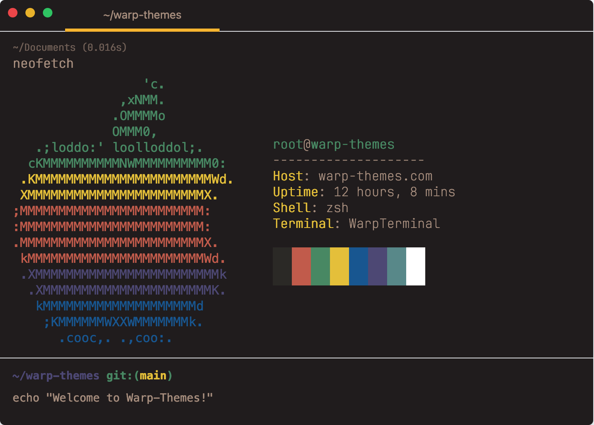

### 117

```
curl -s -N 'https://raw.githubusercontent.com/SilentGlasses/warp_themes/main/mac_installers/117.sh' | bash
```

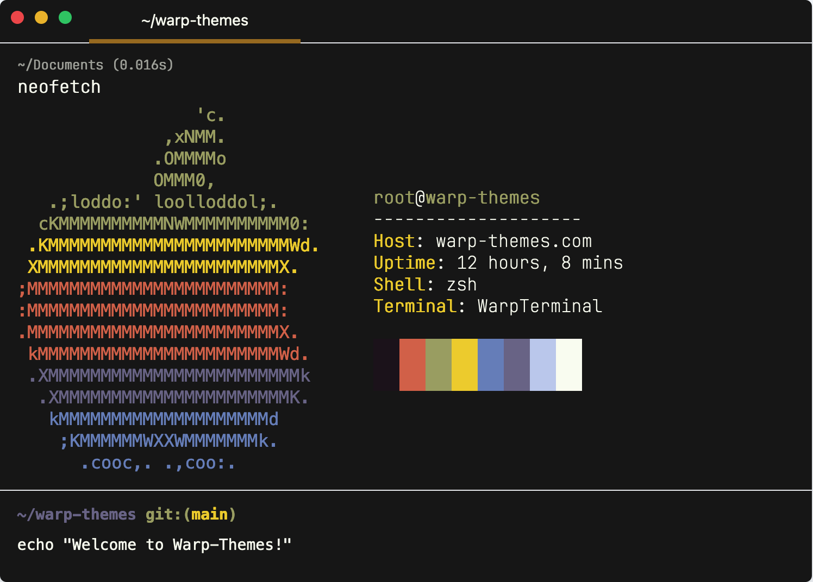

### Kali Blue

```
curl -s -N 'https://raw.githubusercontent.com/SilentGlasses/warp_themes/main/mac_installers/kali_blue.sh' | bash
```

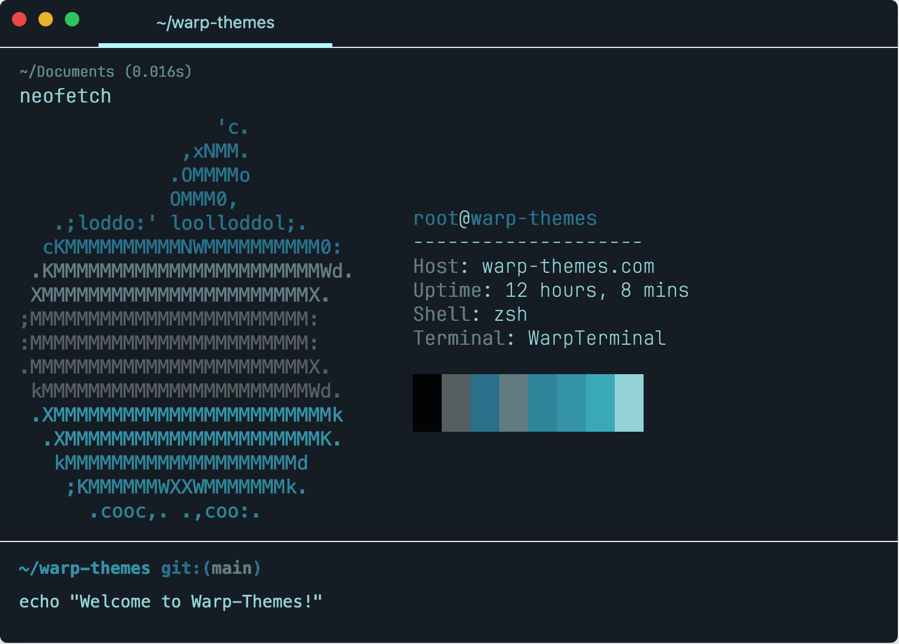

### Material Dark

```
curl -s -N 'https://raw.githubusercontent.com/SilentGlasses/warp_themes/main/mac_installers/material_dark.sh' | bash
```

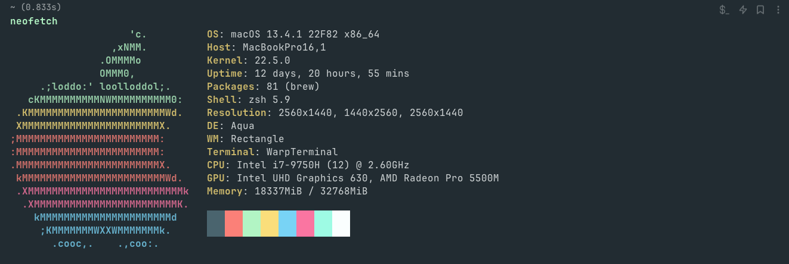

### Matrix Dark

```
curl -s -N 'https://raw.githubusercontent.com/SilentGlasses/warp_themes/main/mac_installers/matrix_dark.sh' | bash
```

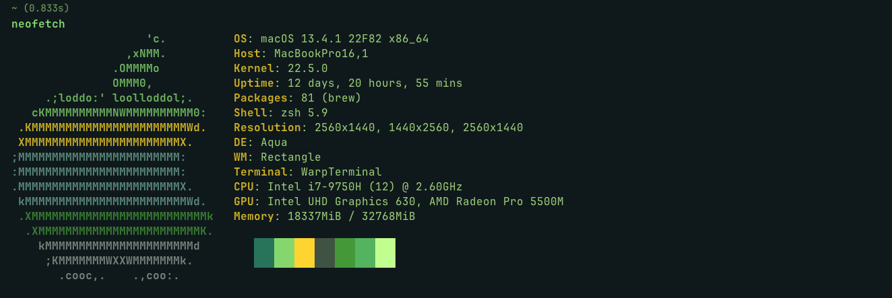

### mjolnir

```
curl -s -N 'https://raw.githubusercontent.com/SilentGlasses/warp_themes/main/mac_installers/mjolnir.sh' | bash
```

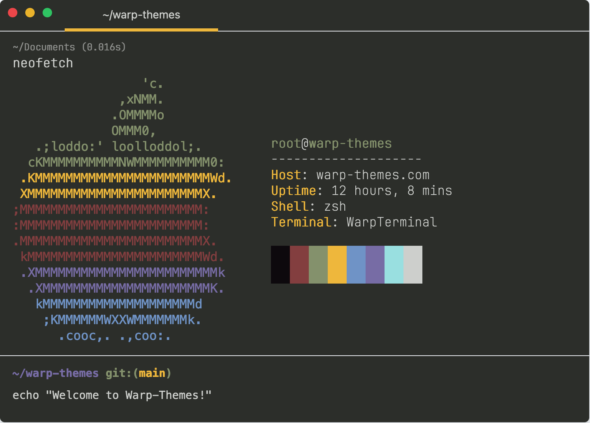

### Nord Dark

```
curl -s -N 'https://raw.githubusercontent.com/SilentGlasses/warp_themes/main/mac_installers/nord_dark.sh' | bash
```

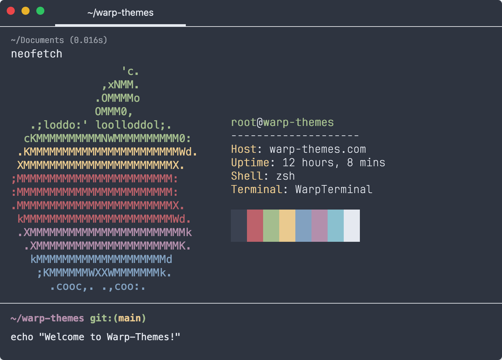

### Nord Light

```
curl -s -N 'https://raw.githubusercontent.com/SilentGlasses/warp_themes/main/mac_installers/nord_light.sh' | bash
```

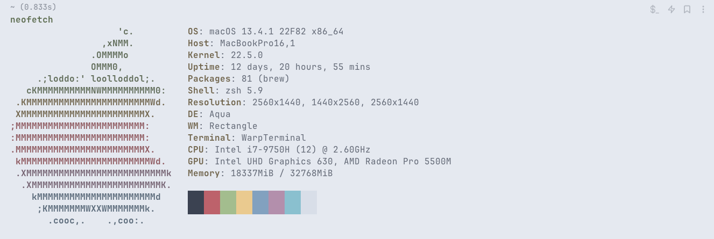

### Proton Dark

```
curl -s -N 'https://raw.githubusercontent.com/SilentGlasses/warp_themes/main/mac_installers/proton_dark.sh' | bash
```

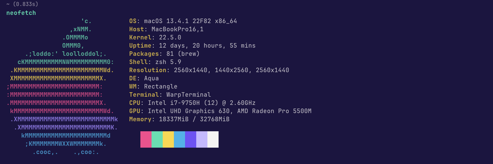

### Retro Green

```
curl -s -N 'https://raw.githubusercontent.com/SilentGlasses/warp_themes/main/mac_installers/retro_green.sh' | bash
```

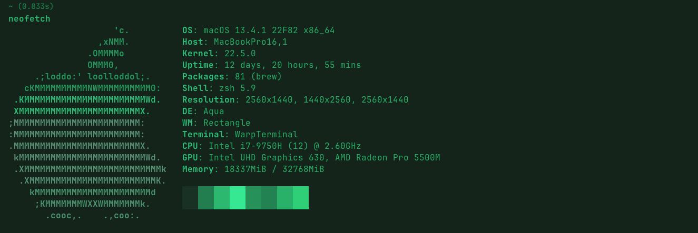

## Vintage Dark

```
curl -s -N 'https://raw.githubusercontent.com/SilentGlasses/warp_themes/main/mac_installers/vintage_dark.sh' | bash
```

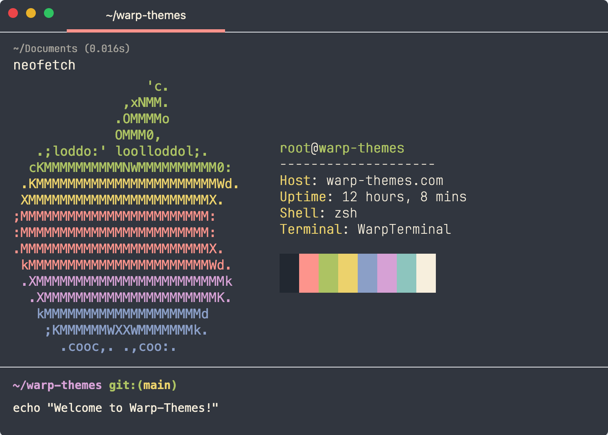
