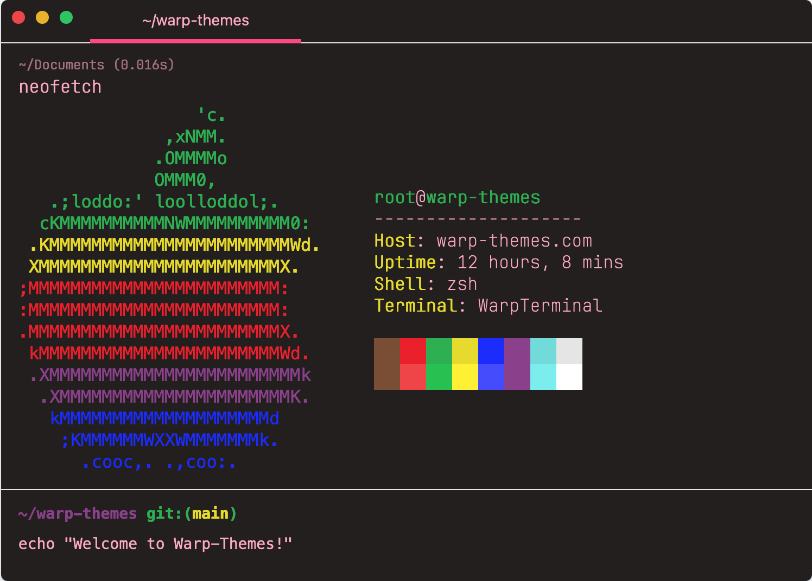
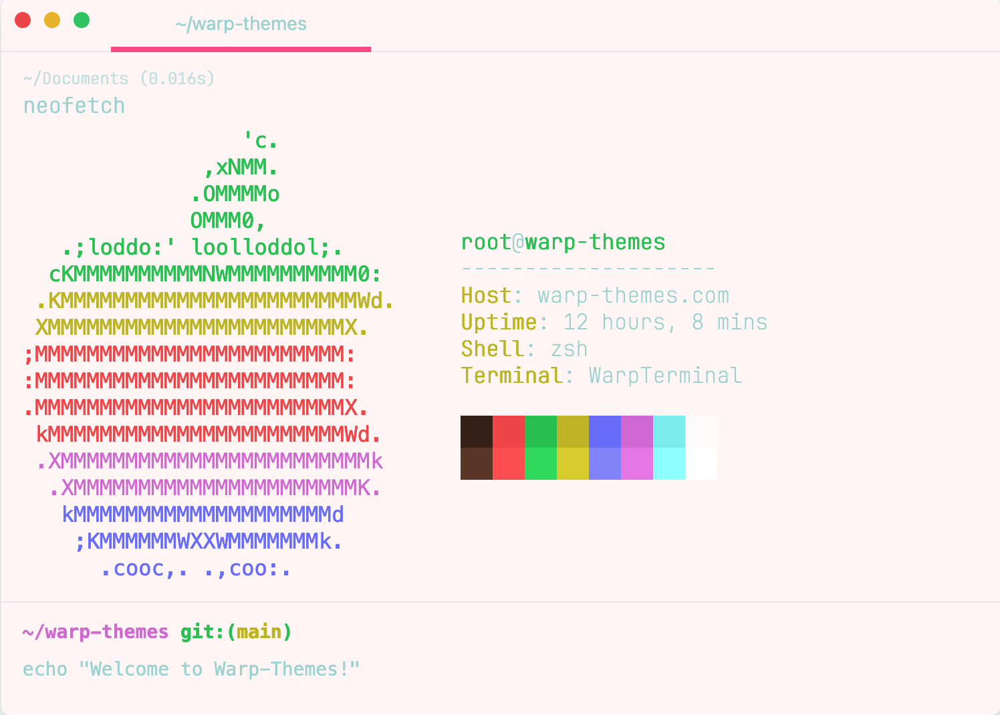
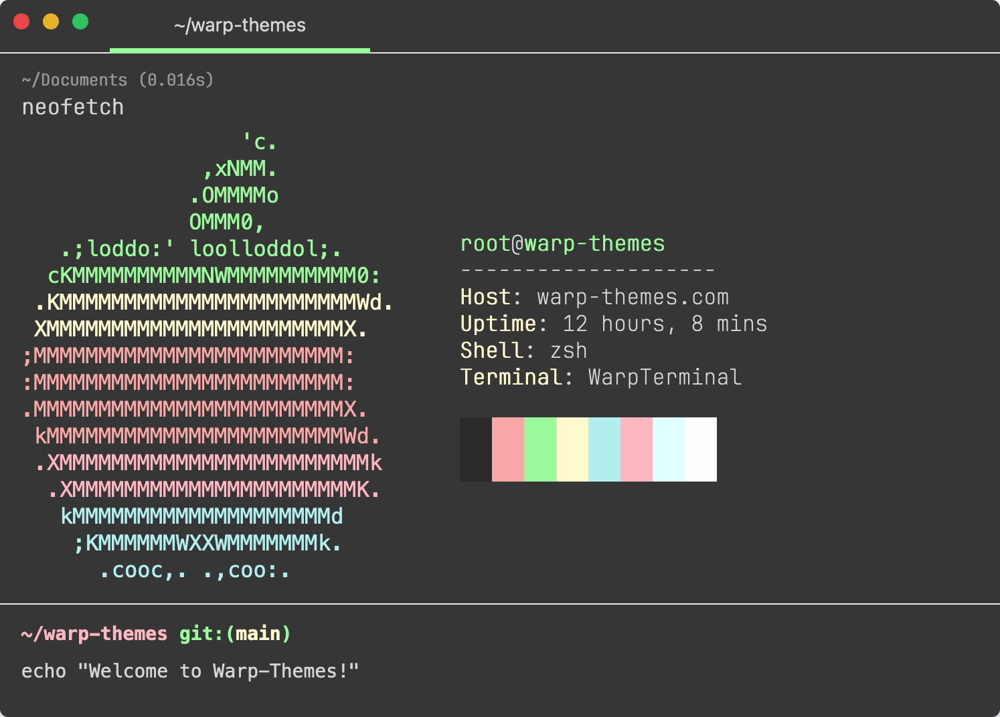
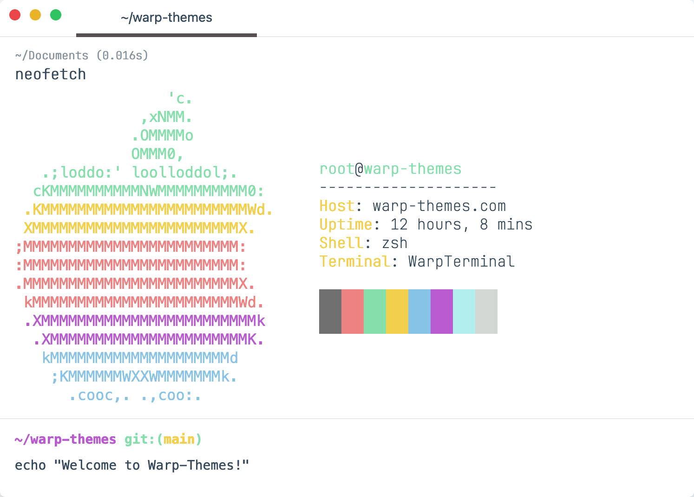
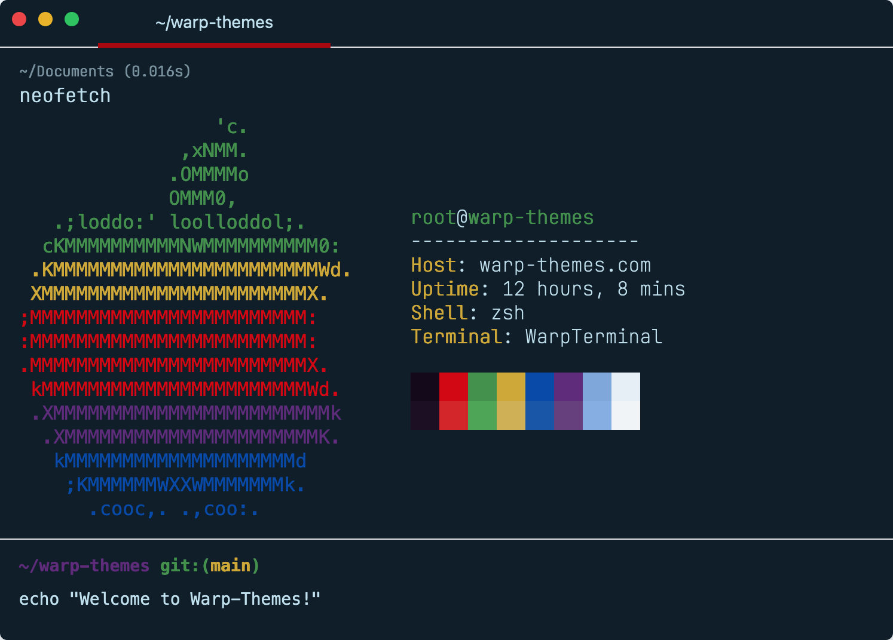

```
                        ⣰⠛⠛⠛⠛⠛⠛⠛⠛⠛⠛⠛⠛⠛⠛⠛⣦
                       ⡞⠐⠐⠐⠐⠐⠐⠐⠐⠐⠐⠐⠐⠐⠐⠐⠐⠿
⣴⣿⣿⣿⣿⣿⣿⣿⣿⣿⣿⣿⣿⣿⣿⣿⣿⣿⣿⡞⠐⠐⠐⠐⠐⠐⠐⠐⠐⠐⠐⠐⠐⠐⠐⠐⠐⠿
⣿⣿⣿⣿⣿⣿⣿⣿⣿⣿⣿⣿⣿⣿⣿⣿⣿⣿⡞⠐⠐⠐⠐⠐⠐⠐⠐⠐⠐⠐⠐⠐⠐⠐⠐⠐⠐⠿
⣿⣿⣿⣿⣿⣿⣿⣿⣿⣿⣿⣿⣿⣿⣿⣿⣿⡞⠐⠐⠐⠐⠐⠐⠐⠐⠐⠐⠐⠐⠐⠐⠐⠐⠐⠐⠐⠿
⣿⣿⣿⣿⣿⣿⣿⣿⣿⣿⣿⣿⣿⣿⣿⣿⡞⠐⠐⠐⠐⠐⠐⠐⠐⠐⠐⠐⠐⠐⠐⠐⠐⠐⠐⠐⠐⠿
⣿⣿⣿⣿⣿⣿⣿⣿⣿⣿⣿⣿⣿⣿⣿⡞⠐⠐⠐⠐⠐⠐⠐⠐⠐⠐⠐⠐⠐⠐⠐⠐⠐⠐⠐⠐⠐⠿
⣿⣿⣿⣿⣿⣿⣿⣿⣿⣿⣿⣿⣿⣿⡞⠐⠐⠐⠐⠐⠐⠐⠐⠐⠐⠐⠐⠐⠐⠐⠐⠐⠐⠐⠐⠐⠐⠿
⣿⣿⣿⣿⣿⣿⣿⣿⣿⣿⣿⣿⣿⡞⠐⠐⠐⠐⠐⠐⠐⠐⠐⠐⠐⠐⠐⠐⠐⠐⠐⠐⠐⠐⠐⠐⠐⠿
⣿⣿⣿⣿⣿⣿⣿⣿⣿⣿⣿⣿⡞⠐⠐⠐⠐⠐⠐⠐⠐⠐⠐⠐⠐⠐⠐⠐⠐⠐⠐⠐⠐⠐⠐⠐⠐⠿
⣿⣿⣿⣿⣿⣿⣿⣿⣿⣿⣿⡞⣤⣤⣤⣤⣤⣤⣤⣤⣤⣤⣤⣤⣤⣤⣤⣤⣤⣤⣤⣤⣤⣤⣤⣤⣤⠟
⣿⣿⣿⣿⣿⣿⣿⣿⣿⣿⣿⣿⣿⣿⣿⣿⣿⣿⡞          Themes for
⠻⣿⣿⣿⣿⣿⣿⣿⣿⣿⣿⣿⣿⣿⣿⣿⣿⡞         Warp Terminal
```

If you want to get Warp, download it from [here](https://app.warp.dev/referral/2K4GVJ)

## Installation on Mac or Linux

1. Run this command to clone the repo and initiate the installer, choose the theme you want to use or install them all:
```
cd ~/Downloads && git clone https://github.com/SilentGlasses/warp_themes.git && cd warp_themes && ./install.sh
```
2. Restart Warp
3. Launch the theme picker: <kbd>ctrl</kbd> + <kbd>⌘</kbd> + <kbd>T</kbd>
4. Select the newly installed theme to enable it
5. Enjoy your new theme

### For Windows

- Ensure PowerShell Allows Script Execution, open PowerShell as Administrator and run:
```
Set-ExecutionPolicy Bypass -Scope Process -Force
```
- Run the script from PowerShell:
```
irm https://raw.githubusercontent.com/SilentGlasses/warp_themes/main/install_warp_themes.ps1 | iex
```
- Using the GUI Installer:
    - A window will appear listing all available themes.
    - Select one or multiple themes and click **Install Selected**.
    - Click **Install All** to install all themes at once.
    - If a theme is already installed, you'll be notified.
    - Click **Exit** to close the installer.

## Warp Theme Installer

The new Warp Theme Installer provides an interactive and user-friendly way to manage your Warp terminal themes. This robust installation script includes:

### Key Features

- 🎨 Interactive Theme Selection
  - Install individual themes or all themes at once with a numbered menu
  - Clean exit option included

- 📊 Real-Time Progress Tracking
  - Live installation status updates
  - Clear success/failure indicators

- 🔍 Smart Theme Management
  - Automatic detection of existing themes
  - Prevents duplicate installations

- 📋 Detailed Installation Reports
  - ✓ Successfully installed themes
  - • Already existing themes
  - ✗ Failed installations (if any)

## Available Themes

### African History


### 117


### Kali Blue


### Material Dark


### Matrix Dark


### mjolnir


### Nord Dark


### Nord Light


### Pride Dark



### Pride Light



### Proton Dark


### Spring Dark



### Spring Light



### Retro Green


### Vintage Dark


### Webs Dark


